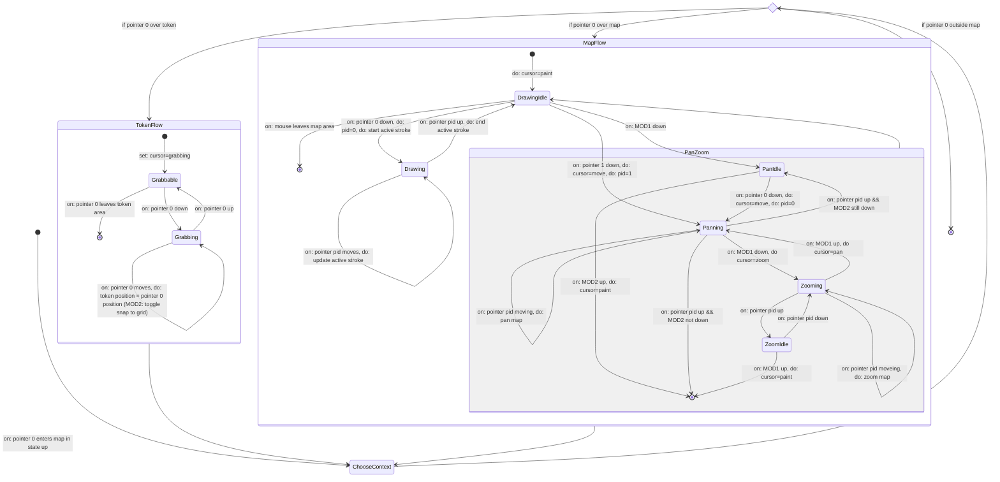

# Input State Machine

```mermaid
stateDiagram-v2
    state ContextChoice <<choice>>
    [*] --> ChooseContext  : on: pointer 0 enters map in state up
    ChooseContext -->  ContextChoice
    ContextChoice --> TokenFlow : if pointer 0 over token
    ContextChoice --> MapFlow : if pointer 0 over map
    ContextChoice --> [*] : if pointer 0 outside map

    state TokenFlow {
        [*] --> Grabbable : set: cursor=grabbing
        Grabbable --> [*] : on: pointer 0 leaves token area
        Grabbable --> Grabbing : on: pointer 0 down
        Grabbing --> Grabbing : on: pointer 0 moves, do: token position = pointer 0 position (MOD2: toggle snap to grid)
        Grabbing --> Grabbable : on: pointer 0 up
    }
    TokenFlow --> ChooseContext

    state MapFlow {
        [*] --> DrawingIdle : do: cursor=paint
        DrawingIdle --> [*] : on: mouse leaves map area

        DrawingIdle --> Drawing : on: pointer 0 down, do: pid=0, do: start acive stroke
        Drawing --> Drawing : on: pointer pid moves, do: update active stroke
        Drawing --> DrawingIdle : on: pointer pid up, do: end active stroke

        DrawingIdle --> PanIdle : on: MOD1 down
        DrawingIdle --> Panning : on: pointer 1 down, do: cursor=move, do: pid=1
        state PanZoom {
            PanIdle --> Panning : on: pointer 0 down, do: cursor=move, do: pid=0
            PanIdle --> [*] : on: MOD2 up, do: cursor=paint
            Panning --> Panning : on: pointer pid moving, do: pan map
            Panning --> Zooming : on: MOD1 down, do cursor=zoom
            Panning --> PanIdle : on: pointer pid up && MOD2 still down
            Panning --> [*] : on: pointer pid up && MOD2 not down
            Zooming --> Zooming : on: pointer pid moveing, do: zoom map
            Zooming --> Panning : on: MOD1 up, do cursor=pan
            Zooming --> ZoomIdle : on: pointer pid up
            ZoomIdle --> Zooming : on: pointer pid down
            ZoomIdle --> [*] : on: MOD1 up, do: cursor=paint
        }
        PanZoom --> DrawingIdle
    }
    MapFlow --> ChooseContext
```